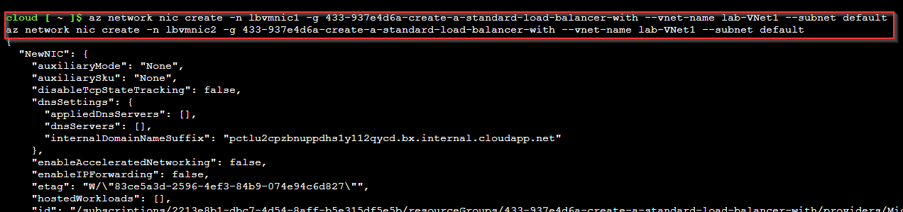

# Create a Standard Load Balancer with Azure CLI

**There are 2 objectives with this lab:**
* Create Virtual Machines
* Create a Load Balancer

## Create Virtual Machines

The lab requires us to create custom virtual machines (VMs) with their own respective NICs so we'll complete that first. We need to be able to log into Azure portal and spin up the Azure CLI. We'll select Bash for this lab so create a storage account and we'll get started. 

Once that's completed, lets start create the VM NICs first and then the VMs. That way we can automatically add the NICs to the VMs when we're creating the VM. So, I had to search the Microsoft website to see the Bash commands to create NICs in the Azure CLI so I will share that now ([click here](https://learn.microsoft.com/en-us/cli/azure/network/nic?view=azure-cli-latest#az-network-nic-create)). 

I used the above command to create the NIC and assign it to the correct subnet. We had to make two VMs so I created to NICs and named them `lbvmnic1` and `lbvmnic2`. 

Once the commands have been accepted, the two NICs should appear in the resource group.

Now lets create the VMs. I also used a Microsoft article for this ([click here](https://learn.microsoft.com/en-us/cli/azure/vm?view=azure-cli-latest#az-vm-create)). Before we're able to do that, we have to remember this is a custom VM so we need to copy the code from the lab and put that in a file first so Azure can reference the file. Here's a glimpse of the code:

So I copied the script into a file using the `code` command followed by the name of the file `code cloud-init.txt`.

Save the code and exit using `Ctrl + S` and `Ctrl + Q` I believe. Now, we can run the code to create the VMs. Use the article above to find the commands to create the VM. The command for the first VM was `az vm create -n lbvm1 -g 433-937e4d6a-create-a-standard-load-balancer-with --image Ubuntu2204 --nics lbvmnic1 --generate-ssh-keys --custom-data cloud-init.txt` which is pretty straightforward besides the `--generate-ssh-keys`. I wasn't aware I had to do that. But obviously we need to express the image. We already created the NICs so we just added that argument in there. The `--custom-data` is where that script will be ran to create our custom VMs. 

Afterwards, you can check the resource group to see if the VMs are there. 

First objective completed! On to the next one. 

## Create a Load Balancer

So for the next task, we need to list the Azure role definitions and assignments using the Linux VM command line. Now I don't have much experience with Linux so I had to google a bunch of commands to see how to create a file, append a file, get a  JSON output, and etc.

I created a Notepad file with all the links I used but I'm sure I'll also post the links here as well. 

The first part of this tasks requires us to list the role definitions and output to a file named `roleinfo.json`. So we need to first find out the `az` command to list the role definitions so I found an article on the Microsoft Azure website ([link here](https://learn.microsoft.com/en-US/cli/azure/role/definition?view=azure-cli-latest#az-role-definition-list)). This is where I found the `az role definition list`. I received the following output. 

If you use that same Microsoft website, you'll see there are additional commands on the left that relate to the `az role` list. So I found the command `az role assignment list --all` to get the role assignments. I wonder why this command required the `--all` argument
but that's fine. 

We need to put all of this information into a JSON file named `roleinfo.json` so I needed to create that file first. I found an article ([link here](https://phoenixnap.com/kb/how-to-create-a-file-in-linux)) that showed an easy way to create files in the Linux terminal. So I used the command `touch` followed by `roleinfo.json` that would create the file. In order to see the file, you use the `ls` command which lists all the files or folders in a directory (s/o CompTIA A+). 

Now that we have the command to list the roles and assignments and we now have the JSON file, lets actually get the output into the file. So I found another article ([link here]((https://askubuntu.com/questions/582536/how-can-i-input-to-a-file-directly-from-the-terminal))) that showed me the `echo` command and how to put that text from that command into a file. To overwrite a file, you use the `>` character. To APPEND a file (add onto the end of a file), you use two of those characters `>>`. I also noticed that you don't need the `echo` command since you're going to get an output from using the two role commands. 

So I used `az role defintition list --output json > roleinfo.json` to take the output from the role command put it into the roleinfo.json file. Then, I used `az role assignment list -all >> roleinfo.json` to append it onto the end of the file. 

Afterwards, I had to see if the information was actually put into the file. I had to google which command to list the contents of the file ([link here](https://www.liquidweb.com/kb/how-to-display-contents-of-a-file-linux/#:~:text=The%20simplest%20way%20to%20view,the%20%2Fproc%2Fversion%20file.)) and I found the `cat` command. 

I use `cat roleinfo.json` and received the proper output:

So this concludes the lab but I found it hard to justify my output. From the above picture, you can see the one of the roles and one of the definitions in the output but you can search through the file. I then rediscovered the `vi` command from the follow article ([link here](https://www.geeksforgeeks.org/vi-editor-unix/)) where I was able to navigate the file much more freely. 

Here is me having more concrete evidence of the role definitions and assignments in the `roleinfo.json` file:

That should suffice. Lab completed!

## Personal Notes

So this lab was way more jarring than the previous very easy 3 labs. I'm not used to Linux, let alone the terminal so I needed to google what commands to use. Also, I didn't want to do a sloppy job so I was trying to find the cleanest way to get the job done. This is where I'm very appreciative of my Cisco CLI experience because command lines can be scary but I know you'll get used to it very quickly the more you use it. It's actually sometimes the easiest way to get jobs done depending on the scale. 

With that being said, I'm so glad I completed this lab without any help because it made me feel more confident in being able to figure out Linux when I have to take that next step. I do have some basic Linux experience from handling the time clock interface to make sure those devices were able to get on our network. I'm familiar with `vi editor`. I'm familiar with `ls` but that's about it right now. 

This was fun. Definitely going to add it to the mental cookie jar as to why I deserve to get a cloud role. 
