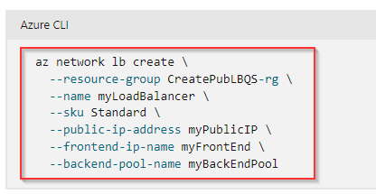

# Create a Standard Load Balancer with Azure CLI

**There are 2 objectives with this lab:**
* Create Virtual Machines
* Create a Load Balancer

## Create Virtual Machines

The lab requires us to create custom virtual machines (VMs) with their own respective NICs so we'll complete that first. We need to be able to log into Azure portal and spin up the Azure CLI. We'll select Bash for this lab so create a storage account and we'll get started. 

Once that's completed, lets start create the VM NICs first and then the VMs. That way we can automatically add the NICs to the VMs when we're creating the VM. So, I had to search the Microsoft website to see the Bash commands to create NICs in the Azure CLI so I will share that now ([click here](https://learn.microsoft.com/en-us/cli/azure/network/nic?view=azure-cli-latest#az-network-nic-create)). 

I used the above command to create the NIC and assign it to the correct subnet. We had to make two VMs so I created to NICs and named them `lbvmnic1` and `lbvmnic2`. 

Once the commands have been accepted, the two NICs should appear in the resource group.

Now lets create the VMs. I also used a Microsoft article for this ([click here](https://learn.microsoft.com/en-us/cli/azure/vm?view=azure-cli-latest#az-vm-create)). Before we're able to do that, we have to remember this is a custom VM so we need to copy the code from the lab and put that in a file first so Azure can reference the file. Here's a glimpse of the code:

So I copied the script into a file using the `code` command followed by the name of the file `code cloud-init.txt`.

Save the code and exit using `Ctrl + S` and `Ctrl + Q` I believe. Now, we can run the code to create the VMs. Use the article above to find the commands to create the VM. The command for the first VM was `az vm create -n lbvm1 -g 433-937e4d6a-create-a-standard-load-balancer-with --image Ubuntu2204 --nics lbvmnic1 --generate-ssh-keys --custom-data cloud-init.txt` which is pretty straightforward besides the `--generate-ssh-keys`. I wasn't aware I had to do that. But obviously we need to express the image. We already created the NICs so we just added that argument in there. The `--custom-data` is where that script will be ran to create our custom VMs. 

Afterwards, you can check the resource group to see if the VMs are there. 

First objective completed! On to the next one. 

## Create a Load Balancer

So the last part of this lab is to create the load balancer itself. Now, I'm familiar with F5 Load Balancers from my network background but I've never actually configured one. The process that I used was create a Public IP and the Load Balancer. Afterwards, we'll create the backend pool with the VMs we previously created and then the LB rule and probe. Finally, we can test out the load balancer to make sure it works. 

First, I had to search for the Microsoft article that outlines how to create LBs which I'll include in this walkthrough ([click here](https://learn.microsoft.com/en-us/azure/load-balancer/quickstart-load-balancer-standard-public-cli)). Lets create the Public IP first. I used the following command to create it.

I named my Public IP `loadbalancerpip` and my command looked something like this: 

Note: I didn't include the `zone` argument because Azure wasn't behaving the way I wanted it to so I left it off. 

I used the following commands to create the load balancer which I named `acgloadbalancer`. 

My command came out like this: 

Once you refresh the resource group, both the Public IP (PIP) and the LB should be listed. 

Note: These commands were from when I first created the LB so I think the code wasn't working the first time. That's probably why I have a `pip2` in there because my first PIP didn't work. Azure automatically created a new PIP so we'll continue with the new PIP.  

Now, lets add the VMs to the Backend Pool. I used the following commands to do that (remember, these are all from the Microsoft LB article). 

My commands were: 

Now lets create the Health Probe and the LB Rule. I'll include those together since I don't really know much about these two commands. The Health Probe I believe just makes sure the LB is working. I don't know what this rule is for. I either forgot or never knew. 

We can check the creation of the Backend Pool and the Health Probe by using the portal:

We can check to see if the LB works by putting it's FrontEnd IP into a web browser. You should get this message and it should alternate between the VMs when you refresh the page.

Lab completed!

## Personal Notes

This lab was actually more difficult than I thought it would be. I actually didn't know how to create the either the Health Prove or the Rule so I looked at the solution. I did the lab weeks ago before I typed all of this out so I wish I could comment on more sticking points but I know I copied down all of the commands so I could recreate it. I also didn't completely finish the lab because my LB didn't cycle through VMs when I refreshed the page. I honestly think this would be WAY easier using the portal instead of the CLI. It was good practice though so I'll take it. Also, I needed help with the `cloud_init` portion because I wasn't aware of how to actually make Azure use that file for the VMs. Definitely learned a lot in this lab. 

I also need to run that do-done command into Chat GPT because it felt convoluted and I didn't understand the structure completely. Still a lot to learn!
